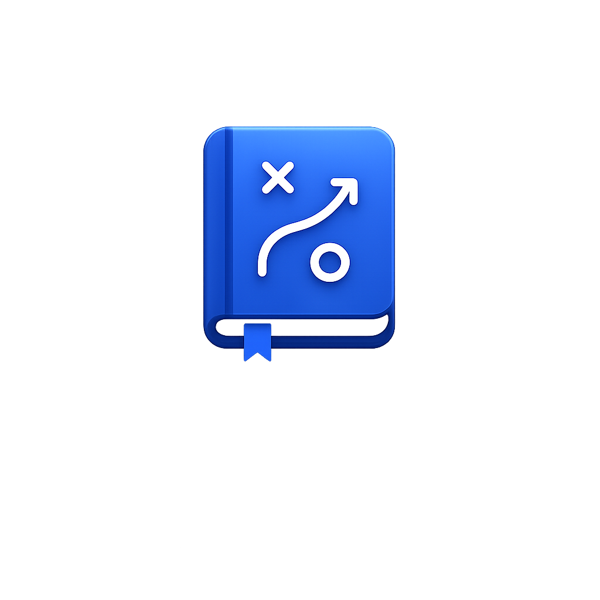
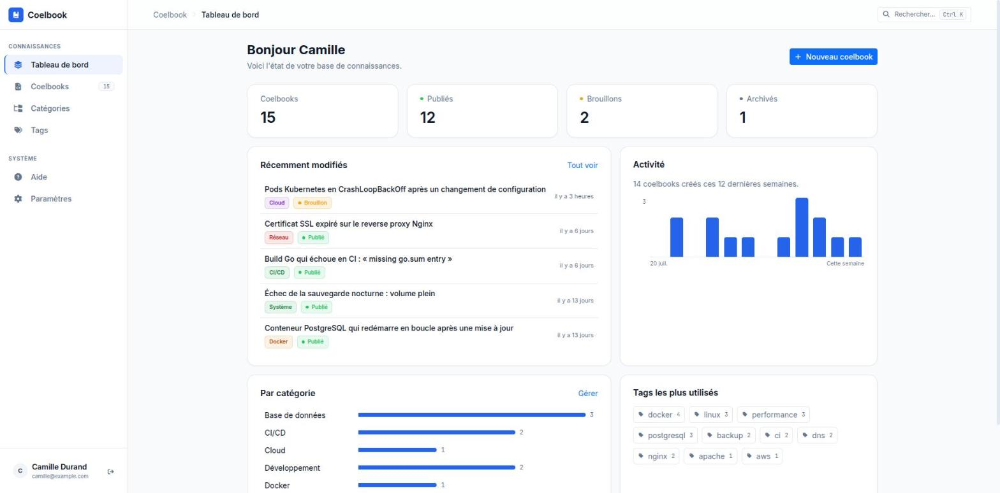
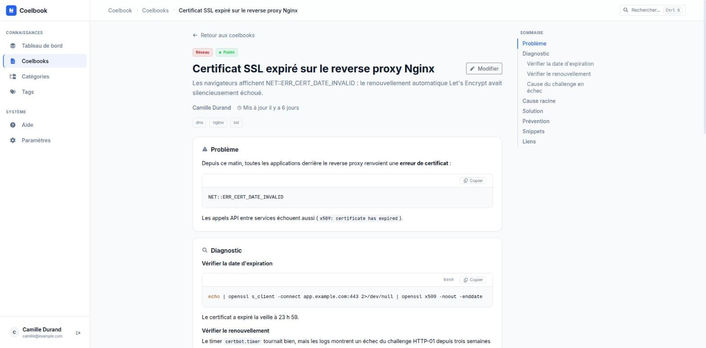
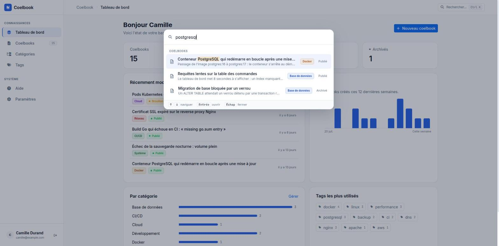
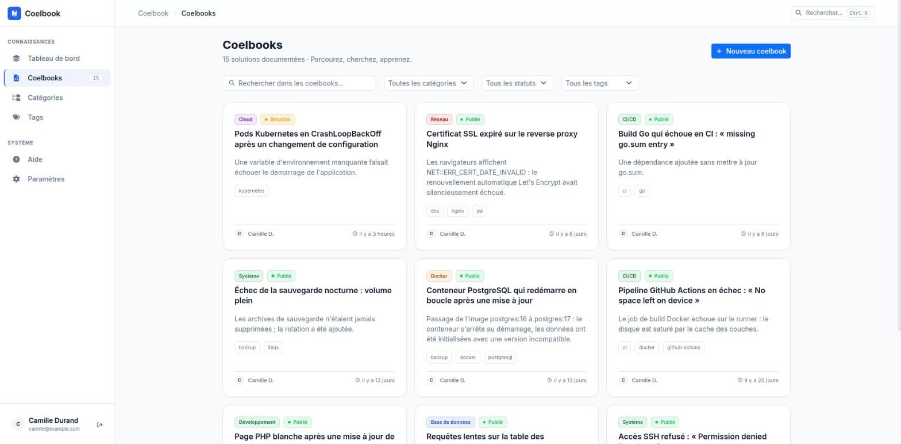
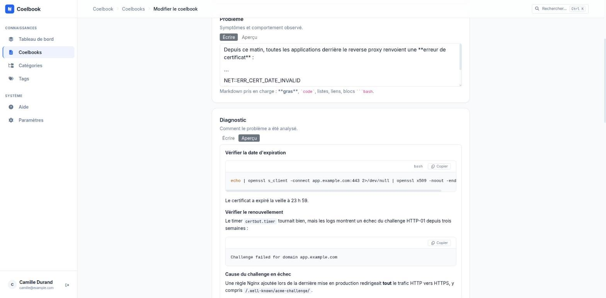
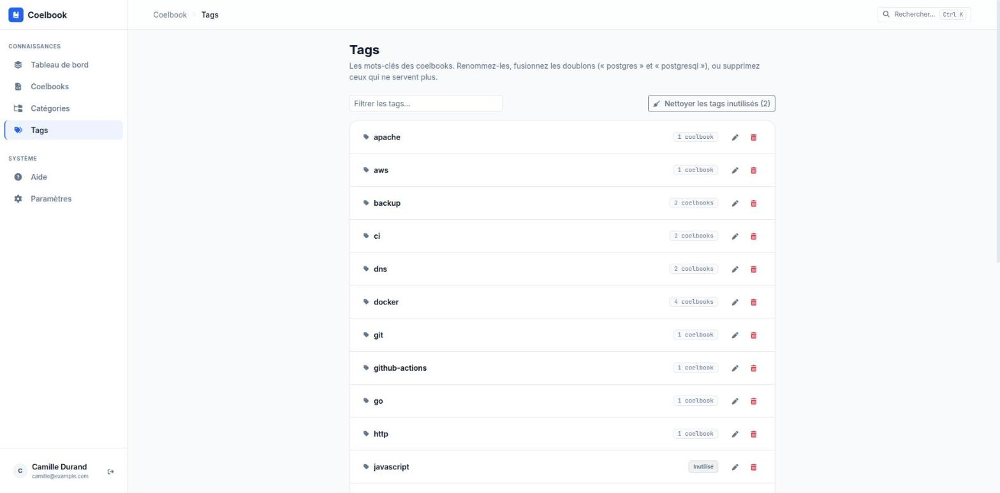

<p align="center">
  
</p>

<h1 align="center">Coelbook</h1>

<p align="center">
  A self-hosted technical knowledge base for documenting and reusing proven solutions.
</p>

<p align="center">

[](api/go.mod)
[](https://react.dev)
[](https://www.typescriptlang.org)
[](https://vite.dev)
[](https://www.postgresql.org)
[](https://www.docker.com)
[](#license)

</p>

---

> Never solve the same problem twice.

Coelbook is a technical knowledge capitalization platform that lets you document, find and reuse solutions to the incidents you run into day to day.

Every problem solved becomes knowledge you, your team, or an AI assistant can reuse.

<p align="center">
  
</p>

---

# Why?

Every developer spends a significant part of their time solving problems they've already run into before:

- Git error
- Docker configuration
- SSH issue
- CI/CD incident
- Kubernetes error
- Traefik configuration
- PostgreSQL issue

A few months later…

…the same research starts all over again.

Coelbook turns every resolution into a lasting resource.

---

# Vision

Coelbook is not a wiki.

Coelbook is a technical experience capitalization platform.

Every incident follows a lifecycle:

```text
Incident

↓

Investigation

↓

Diagnosis

↓

Resolution

↓

Capitalization

↓

Reuse
```

The goal is simple:

> **Build your technical memory.**

---

# Screenshots

The interface is in French. Screenshots are taken on demo data.

<table>
  <tr>
    <td width="50%">
      
      <p align="center"><b>Incident page</b> — structured sections, highlighted code with a copy button, and a table of contents.</p>
    </td>
    <td width="50%">
      
      <p align="center"><b>Quick search (Ctrl/⌘K)</b> — full-text search from any page, matches highlighted.</p>
    </td>
  </tr>
  <tr>
    <td width="50%">
      
      <p align="center"><b>Incident list</b> — search and filters by category, status and tag.</p>
    </td>
    <td width="50%">
      
      <p align="center"><b>Editor</b> — sections written in Markdown, with a live preview.</p>
    </td>
  </tr>
  <tr>
    <td width="50%">
      
      <p align="center"><b>Tags</b> — rename, merge duplicates, clean up unused tags.</p>
    </td>
    <td width="50%"></td>
  </tr>
</table>

---

# Features

Version 0.1 — see the [CHANGELOG](CHANGELOG.md) and the [user guide](docs/guide/user-guide.md).

## Incidents

Every incident documents one problem and its resolution:

- title, summary, category, tags and status (draft / published / archived)
- problem, diagnosis, root cause, solution and prevention, written in Markdown
- snippets — reusable commands and code, syntax-highlighted, one click to copy
- links to documentation, tickets or articles

---

## Search

- full-text search over every field, tags and snippets, ranked by relevance
- accent-insensitive, with highlighted matches
- `"exact phrase"`, `-exclude` and `or`
- filters by category, status and tag, kept in the URL so a search can be shared

---

## Dashboard

Key figures, recently updated incidents, weekly activity, and how the knowledge base is spread across categories and tags.

---

## REST API

The application is entirely driven by a REST API, documented with OpenAPI, with stable error codes.

The frontend, the CLI and future extensions will all use the same API.

---

## Planned

- table of contents and change history for incidents
- quick search (command palette)
- attachments and image uploads
- user management, roles and teams
- an AI assistant to analyze a log, find an existing resolution or draft a write-up

See the [roadmap](docs/architecture/roadmap.md).

---

# Use cases

Coelbook can document incidents related to:

- Git
- GitHub
- Docker
- Kubernetes
- Linux
- SSH
- Go
- Symfony
- PostgreSQL
- WordPress
- Apache
- Nginx
- CI/CD
- GitHub Actions
- OpenAI
- Ollama

---

# Tech stack

## API

- Go (standard library `net/http` router)
- PostgreSQL (full-text search)
- sqlc
- goose
- JWT
- OpenAPI

## Frontend

- React
- TypeScript
- Vite
- Bootstrap 5
- react-markdown, highlight.js

## Database

- PostgreSQL

## Deployment

- Docker
- Docker Compose

La justification de chaque dépendance npm et Go déclarée est disponible dans
la [documentation des dépendances](docs/dependencies.md).

---

# Requirements

- Docker
- Docker Compose
- [goose CLI](https://github.com/pressly/goose#install) — required on your machine to run database migrations (`make migrate-up`, `make migrate-down`, `make migrate-create`)
- [sqlc CLI](https://docs.sqlc.dev/en/latest/overview/install.html) — required to regenerate Go code from SQL queries (`make sqlc`)

---

# Getting started

## Setup

1. Copy the environment file:

   ```bash
   cp .env.example .env
   ```

2. Start the environment:

   ```bash
   make up
   ```

   This command:
   - adds `coelbook.local` and `api.coelbook.local` to `/etc/hosts` (asks for your sudo password)
   - copies `.env.example` to `.env` if it doesn't exist yet
   - builds and starts the containers: PostgreSQL, API (hot-reload via [air](https://github.com/air-verse/air)), frontend (Vite dev server), nginx, Adminer and Mailpit

3. Create the database schema:

   ```bash
   make migrate-up
   ```

   Run it again after pulling changes that add migrations.

4. Open http://coelbook.local and follow the setup wizard to create the administrator account. Default categories and tags are already there (created by the migrations). The [user guide](docs/guide/user-guide.md) takes it from there.

## Available services

| Service    | URL                        |
| ---------- | -------------------------- |
| Frontend   | http://coelbook.local      |
| API        | http://api.coelbook.local  |
| Adminer    | http://localhost:8081      |
| Mailpit    | http://localhost:8025      |
| PostgreSQL | localhost:5432             |

## Stopping

```bash
make down
```

Stops the containers and removes `coelbook.local`/`api.coelbook.local` from `/etc/hosts`.

## Other useful commands

| Command | Description |
| --- | --- |
| `make logs` | Follow the containers' logs |
| `make ps` | List the containers |
| `make bash` | Open a shell in the API container |
| `make restart` | Restart the environment |
| `make migrate-up` | Apply migrations |
| `make migrate-down` | Roll back the last migration |
| `make sqlc` | Regenerate Go code from SQL queries |
| `make module m="name"` | Scaffold a new API module and wire it into the router |
| `make check` | Run go fmt, go vet and the Go tests |
| `make clean-branches` | Delete every branch except `main` and `develop` (remote: repository owner only) |

The full list of commands is available via:

```bash
make help
```

---

# Architecture

```text
                Frontend (React + TypeScript)

                  │

            REST API

                  │

               Go API

                  │

             PostgreSQL
```

---

# Documentation

| Document | Description |
| --- | --- |
| [docs/guide/user-guide.md](docs/guide/user-guide.md) | User guide: writing, searching and organizing incidents |
| [docs/development.md](docs/development.md) | Development guide: layout, conventions, error codes, workflow |
| [docs/architecture/domain.md](docs/architecture/domain.md) | Domain model: core concepts, entities, terminology |
| [docs/architecture/data-model.md](docs/architecture/data-model.md) | Data model: entities, fields, relationships |
| [docs/architecture/roadmap.md](docs/architecture/roadmap.md) | Roadmap by theme: what is done, what is next |
| [docs/releases/versioning.md](docs/releases/versioning.md) | Versioning strategy and release process |
| [CHANGELOG.md](CHANGELOG.md) | Changes in each release |

---

# License

MIT — see [LICENSE](LICENSE) for details.
